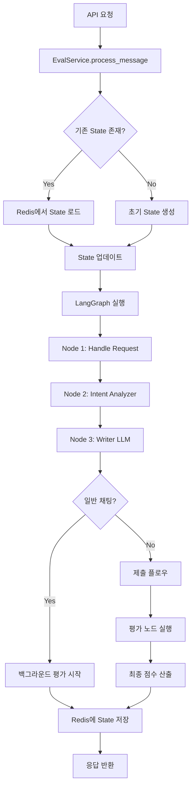

# LangGraph State 흐름 및 DB 저장 전략

## 📋 목차
1. [LangGraph와 DB의 형식 차이](#1-langgraph와-db의-형식-차이)
2. [State 흐름 분석](#2-state-흐름-분석)
3. [PostgreSQL 저장 전략](#3-postgresql-저장-전략)
4. [Redis 저장 전략](#4-redis-저장-전략)
5. [형식 변환 매핑](#5-형식-변환-매핑)

---

## 1. LangGraph와 DB의 형식 차이

### 🔴 **핵심 문제: 형식 불일치**

#### **1.1 LangGraph State 형식**

```python
# app/langgraph/states.py
class MainGraphState(TypedDict):
    messages: Annotated[list, add_messages]  # ⚠️ LangChain BaseMessage 객체
    # ...
```

**특징:**
- `messages`는 **LangChain의 `BaseMessage` 객체 리스트**
- `add_messages` 리듀서가 자동으로 메시지를 병합
- 메시지 객체는 `HumanMessage`, `AIMessage` 등 LangChain 타입
- 추가 속성: `turn`, `timestamp` 등 커스텀 필드 가능

**실제 메시지 구조:**
```python
# LangGraph 내부에서 사용되는 형식
[
    HumanMessage(
        content="사용자 메시지",
        turn=1,
        timestamp="2024-01-01T00:00:00"
    ),
    AIMessage(
        content="AI 응답",
        turn=1,
        timestamp="2024-01-01T00:00:01"
    ),
    # ...
]
```

#### **1.2 PostgreSQL DB 형식**

```python
# app/db/models/sessions.py
class PromptMessage(Base):
    id: int
    session_id: int
    turn: int
    role: PromptRoleEnum  # "user" | "assistant"
    content: str
    token_count: int
    meta: Optional[dict]  # JSONB
    created_at: datetime
```

**특징:**
- **관계형 DB 구조** (정규화된 테이블)
- `role`은 Enum 타입 (`PromptRoleEnum`)
- `meta` 필드에 추가 메타데이터 저장 (JSONB)
- LangChain 객체와 **완전히 다른 구조**

**실제 DB 레코드:**
```sql
-- prompt_messages 테이블
id | session_id | turn | role      | content        | meta
1  | 100        | 1    | user      | "사용자 메시지" | NULL
2  | 100        | 1    | assistant | "AI 응답"      | NULL
```

#### **1.3 Redis 저장 형식**

```python
# app/db/repositories/state_repo.py
def _serialize_messages(self, messages: list) -> list:
    """LangChain 메시지 객체를 JSON 직렬화 가능한 dict로 변환"""
    serialized = []
    for msg in messages:
        if hasattr(msg, '__dict__'):
            serialized_msg = {
                "type": getattr(msg, 'type', 'unknown'),
                "content": getattr(msg, 'content', ''),
            }
            # turn, role, timestamp 등 추가 속성 보존
            # ...
```

**특징:**
- **JSON 직렬화된 dict 형태**
- LangChain 객체를 dict로 변환하여 저장
- Redis는 문자열 기반이므로 객체 직렬화 필수

**실제 Redis 저장 형식:**
```json
{
  "langgraph:state:session_123": {
    "messages": [
      {
        "type": "human",
        "content": "사용자 메시지",
        "turn": 1,
        "timestamp": "2024-01-01T00:00:00"
      },
      {
        "type": "ai",
        "content": "AI 응답",
        "turn": 1,
        "timestamp": "2024-01-01T00:00:01"
      }
    ],
    "current_turn": 1,
    "session_id": "session_123",
    // ... 기타 필드
  }
}
```

---

### ⚠️ **형식 차이로 인한 문제점**

#### **문제 1: 직렬화/역직렬화 복잡도**
```python
# ❌ 직접 변환 불가능
langgraph_messages = state["messages"]  # LangChain 객체 리스트
db_messages = PromptMessage(...)  # SQLAlchemy 모델

# ✅ 변환 로직 필요
def convert_langgraph_to_db(langgraph_msg):
    return PromptMessage(
        role=langgraph_msg.type,  # "human" → "user"
        content=langgraph_msg.content,
        turn=langgraph_msg.turn,
        # ...
    )
```

#### **문제 2: 타입 불일치**
- LangGraph: `HumanMessage`, `AIMessage` (LangChain 타입)
- PostgreSQL: `PromptRoleEnum` ("user", "assistant")
- Redis: JSON dict (`{"type": "human", ...}`)

#### **문제 3: 메타데이터 손실 위험**
- LangGraph의 커스텀 속성 (`turn`, `timestamp`)이 DB에 저장되지 않으면 손실
- Redis 직렬화 시 일부 속성이 누락될 수 있음

---

## 2. State 흐름 분석

### 📊 **전체 State 흐름도**



### 🔄 **단계별 State 변화**

#### **Step 1: 초기 요청 (첫 메시지)**

```python
# 1. 초기 State 생성
state = {
    "session_id": "session_123",
    "exam_id": 1,
    "participant_id": 1,
    "spec_id": 1,
    "messages": [],  # 빈 리스트
    "current_turn": 0,
    "human_message": "안녕하세요",
    "ai_message": None,
    # ...
}

# 2. Redis 저장 (아직 없음)
# → get_state() → None → 초기 State 사용
```

#### **Step 2: Node 1 (Handle Request)**

```python
# State 업데이트
state = {
    "current_turn": 1,  # 0 → 1 증가
    "updated_at": "2024-01-01T00:00:00",
    # ...
}
```

#### **Step 3: Node 2 (Intent Analyzer)**

```python
# State 업데이트
state = {
    "intent_status": "PASSED_HINT",
    "is_guardrail_failed": False,
    "guardrail_message": None,
    # ...
}
```

#### **Step 4: Node 3 (Writer LLM)**

```python
# State 업데이트 (가장 중요!)
state = {
    "messages": [  # ⚠️ LangChain 객체 추가
        {
            "turn": 1,
            "role": "user",
            "content": "안녕하세요",
            "timestamp": "2024-01-01T00:00:00"
        },
        {
            "turn": 1,
            "role": "assistant",
            "content": "안녕하세요! 무엇을 도와드릴까요?",
            "timestamp": "2024-01-01T00:00:01"
        }
    ],
    "ai_message": "안녕하세요! 무엇을 도와드릴까요?",
    "writer_status": "SUCCESS",
    # ...
}
```

#### **Step 5: Redis 저장**

```python
# StateRepository.save_state()
# → _serialize_messages() 호출
# → LangChain 객체를 dict로 변환
serialized_state = {
    "messages": [
        {
            "type": "human",
            "content": "안녕하세요",
            "turn": 1,
            "timestamp": "2024-01-01T00:00:00"
        },
        {
            "type": "ai",
            "content": "안녕하세요! 무엇을 도와드릴까요?",
            "turn": 1,
            "timestamp": "2024-01-01T00:00:01"
        }
    ],
    "current_turn": 1,
    # ... 기타 필드
}

# Redis 저장
await redis.set_json("langgraph:state:session_123", serialized_state, ttl=86400)
```

#### **Step 6: 다음 요청 (두 번째 메시지)**

```python
# 1. Redis에서 State 로드
existing_state = await redis.get_json("langgraph:state:session_123")
# → dict 형태로 반환 (LangChain 객체 아님!)

# 2. State 업데이트
existing_state["human_message"] = "두 번째 메시지"
existing_state["current_turn"] = 1  # 아직 증가 안 함

# 3. LangGraph 실행
# → Node 1에서 current_turn 증가 (1 → 2)
# → Node 3에서 messages에 새 메시지 추가
```

---

## 3. PostgreSQL 저장 전략

### 📌 **저장 시점**

#### **현재 구현: 제출 시점에만 저장**

```python
# app/services/eval_service.py
async def submit_code(...):
    # 1. LangGraph 실행 (평가 포함)
    result = await self.graph.ainvoke(state, config)
    
    # 2. 제출 완료 후 PostgreSQL 저장
    # → session_repo.end_session()
    # → session_repo.add_message() (모든 턴)
```

#### **권장 개선: 채팅 중에도 저장 (선택적)**

```python
# app/langgraph/nodes/writer.py
async def writer_llm(state: MainGraphState):
    # ... AI 응답 생성 ...
    
    # ✅ 백그라운드로 PostgreSQL 저장
    asyncio.create_task(
        save_message_to_db(
            session_id=session_id,
            turn=current_turn,
            role="user",
            content=human_message
        )
    )
    asyncio.create_task(
        save_message_to_db(
            session_id=session_id,
            turn=current_turn,
            role="assistant",
            content=ai_content
        )
    )
```

### 🔄 **형식 변환 로직**

#### **LangGraph → PostgreSQL 변환**

```python
# app/db/repositories/session_repo.py
async def add_message_from_langgraph_state(
    self,
    session_id: int,
    langgraph_message: dict  # Redis에서 로드한 dict 형태
) -> PromptMessage:
    """
    LangGraph State의 메시지를 PostgreSQL 형식으로 변환
    
    [입력 형식]
    {
        "type": "human" | "ai",
        "content": "...",
        "turn": 1,
        "timestamp": "..."
    }
    
    [출력 형식]
    PromptMessage(
        role=PromptRoleEnum.USER | PromptRoleEnum.ASSISTANT,
        content="...",
        turn=1,
        meta={"timestamp": "..."}
    )
    """
    # 타입 매핑
    role_map = {
        "human": PromptRoleEnum.USER,
        "ai": PromptRoleEnum.ASSISTANT,
        "user": PromptRoleEnum.USER,
        "assistant": PromptRoleEnum.ASSISTANT,
    }
    
    role = role_map.get(langgraph_message.get("type", "").lower())
    if not role:
        raise ValueError(f"Unknown message type: {langgraph_message.get('type')}")
    
    # 메타데이터 추출
    meta = {
        "timestamp": langgraph_message.get("timestamp"),
        "original_type": langgraph_message.get("type"),
    }
    
    # DB 레코드 생성
    message = PromptMessage(
        session_id=session_id,
        turn=langgraph_message.get("turn", 0),
        role=role,
        content=langgraph_message.get("content", ""),
        token_count=0,  # TODO: 실제 토큰 수 계산
        meta=meta,
        created_at=datetime.utcnow()
    )
    
    self.db.add(message)
    await self.db.flush()
    return message
```

### 📊 **PostgreSQL 저장 데이터 구조**

```sql
-- prompt_sessions 테이블
INSERT INTO prompt_sessions (exam_id, participant_id, spec_id, started_at)
VALUES (1, 1, 1, '2024-01-01 00:00:00');

-- prompt_messages 테이블 (턴별로 2개씩)
INSERT INTO prompt_messages (session_id, turn, role, content, meta)
VALUES 
  (100, 1, 'user', '안녕하세요', '{"timestamp": "2024-01-01T00:00:00"}'),
  (100, 1, 'assistant', '안녕하세요! 무엇을 도와드릴까요?', '{"timestamp": "2024-01-01T00:00:01"}'),
  (100, 2, 'user', '두 번째 메시지', '{"timestamp": "2024-01-01T00:00:02"}'),
  (100, 2, 'assistant', '두 번째 응답', '{"timestamp": "2024-01-01T00:00:03"}');
```

---

## 4. Redis 저장 전략

### 📌 **저장 시점**

#### **매 노드 실행 후 저장**

```python
# app/services/eval_service.py
async def process_message(...):
    # 1. 기존 State 로드
    existing_state = await self.state_repo.get_state(session_id)
    
    # 2. LangGraph 실행
    result = await self.graph.ainvoke(state, config)
    
    # 3. 실행 후 즉시 Redis 저장
    await self.state_repo.save_state(session_id, result)
```

### 🔄 **직렬화 프로세스**

```python
# app/db/repositories/state_repo.py
async def save_state(self, session_id: str, state: dict, ttl_seconds: Optional[int] = None):
    # 1. messages 직렬화
    state_copy = {**state}
    if 'messages' in state_copy:
        state_copy['messages'] = self._serialize_messages(state_copy['messages'])
    
    # 2. 메타데이터 추가
    state_with_meta = {
        **state_copy,
        "_meta": {
            "updated_at": datetime.utcnow().isoformat(),
            "session_id": session_id
        }
    }
    
    # 3. Redis 저장
    return await self.redis.save_graph_state(session_id, state_with_meta, ttl_seconds)
```

### 📊 **Redis 저장 데이터 구조**

```json
{
  "langgraph:state:session_123": {
    "session_id": "session_123",
    "exam_id": 1,
    "participant_id": 1,
    "spec_id": 1,
    "messages": [
      {
        "type": "human",
        "content": "안녕하세요",
        "turn": 1,
        "timestamp": "2024-01-01T00:00:00"
      },
      {
        "type": "ai",
        "content": "안녕하세요! 무엇을 도와드릴까요?",
        "turn": 1,
        "timestamp": "2024-01-01T00:00:01"
      }
    ],
    "current_turn": 1,
    "human_message": "안녕하세요",
    "ai_message": "안녕하세요! 무엇을 도와드릴까요?",
    "intent_status": "PASSED_HINT",
    "is_guardrail_failed": false,
    "writer_status": "SUCCESS",
    "turn_scores": {},
    "created_at": "2024-01-01T00:00:00",
    "updated_at": "2024-01-01T00:00:01",
    "_meta": {
      "updated_at": "2024-01-01T00:00:01",
      "session_id": "session_123"
    }
  },
  
  "turn_logs:session_123:1": {
    "turn_number": 1,
    "user_prompt_summary": "안녕하세요",
    "prompt_evaluation_details": {
      "intent": "HINT_OR_QUERY",
      "score": 75,
      "rubrics": [...],
      "final_reasoning": "..."
    },
    "llm_answer_summary": "...",
    "llm_answer_reasoning": "...",
    "timestamp": "2024-01-01T00:00:05"
  },
  
  "turn_mapping:session_123": {
    "1": {"start_msg_idx": 0, "end_msg_idx": 1},
    "2": {"start_msg_idx": 2, "end_msg_idx": 3}
  }
}
```

### ⏰ **TTL (Time To Live) 설정**

```python
# app/core/config.py
CHECKPOINT_TTL_SECONDS = 86400  # 24시간

# Redis 저장 시 TTL 적용
await redis.set_json(
    "langgraph:state:session_123",
    state,
    ttl_seconds=86400  # 24시간 후 자동 삭제
)
```

---

## 5. 형식 변환 매핑

### 🔄 **변환 매트릭스**

| 구분 | LangGraph (메모리) | Redis (저장) | PostgreSQL (영구) |
|------|-------------------|--------------|-------------------|
| **메시지 타입** | `HumanMessage`, `AIMessage` | `{"type": "human", ...}` | `PromptRoleEnum.USER`, `PromptRoleEnum.ASSISTANT` |
| **메시지 구조** | LangChain 객체 | JSON dict | SQLAlchemy 모델 |
| **턴 정보** | 객체 속성 (`msg.turn`) | dict 필드 (`msg["turn"]`) | 테이블 컬럼 (`turn`) |
| **타임스탬프** | 객체 속성 (`msg.timestamp`) | dict 필드 (`msg["timestamp"]`) | `meta` JSONB 필드 |
| **직렬화** | 불필요 (메모리) | JSON 직렬화 | SQL INSERT |

### 📝 **변환 함수 예시**

#### **1. LangGraph → Redis (직렬화)**

```python
def serialize_langgraph_message(msg) -> dict:
    """LangChain 메시지 객체 → Redis dict"""
    if hasattr(msg, 'type'):
        return {
            "type": msg.type,  # "human" | "ai"
            "content": msg.content,
            "turn": getattr(msg, 'turn', None),
            "timestamp": getattr(msg, 'timestamp', None),
        }
    elif isinstance(msg, dict):
        return msg  # 이미 dict
    else:
        return {"content": str(msg)}
```

#### **2. Redis → LangGraph (역직렬화)**

```python
def deserialize_redis_message(msg_dict: dict):
    """Redis dict → LangChain 메시지 객체"""
    from langchain_core.messages import HumanMessage, AIMessage
    
    msg_type = msg_dict.get("type", "unknown")
    content = msg_dict.get("content", "")
    
    if msg_type == "human":
        msg = HumanMessage(content=content)
    elif msg_type == "ai":
        msg = AIMessage(content=content)
    else:
        raise ValueError(f"Unknown message type: {msg_type}")
    
    # 커스텀 속성 추가
    if "turn" in msg_dict:
        msg.turn = msg_dict["turn"]
    if "timestamp" in msg_dict:
        msg.timestamp = msg_dict["timestamp"]
    
    return msg
```

#### **3. Redis → PostgreSQL (DB 저장)**

```python
def convert_redis_to_postgres(redis_msg: dict, session_id: int) -> PromptMessage:
    """Redis dict → PostgreSQL 모델"""
    role_map = {
        "human": PromptRoleEnum.USER,
        "ai": PromptRoleEnum.ASSISTANT,
    }
    
    return PromptMessage(
        session_id=session_id,
        turn=redis_msg.get("turn", 0),
        role=role_map.get(redis_msg.get("type", "").lower()),
        content=redis_msg.get("content", ""),
        meta={
            "timestamp": redis_msg.get("timestamp"),
            "original_type": redis_msg.get("type"),
        }
    )
```

---

## 📌 **요약 및 권장사항**

### ✅ **현재 구조의 장점**
1. **Redis**: 실시간 State 관리 (빠른 읽기/쓰기)
2. **PostgreSQL**: 영구 저장 (장기 보관)
3. **분리된 책임**: 각 저장소의 역할이 명확

### ⚠️ **개선 필요 사항**
1. **형식 변환 로직 표준화**: 변환 함수를 중앙화하여 일관성 유지
2. **메타데이터 보존**: `turn`, `timestamp` 등 커스텀 속성 손실 방지
3. **채팅 중 DB 저장**: 제출 시점뿐만 아니라 채팅 중에도 선택적으로 저장
4. **에러 처리**: 변환 실패 시 롤백 및 재시도 메커니즘

### 🎯 **권장 구현 순서**
1. **Phase 1**: 형식 변환 함수 구현 및 테스트
2. **Phase 2**: 채팅 중 DB 저장 (백그라운드)
3. **Phase 3**: 메타데이터 보존 강화
4. **Phase 4**: 에러 처리 및 모니터링

---

**작성일**: 2024-01-01  
**버전**: 1.0

